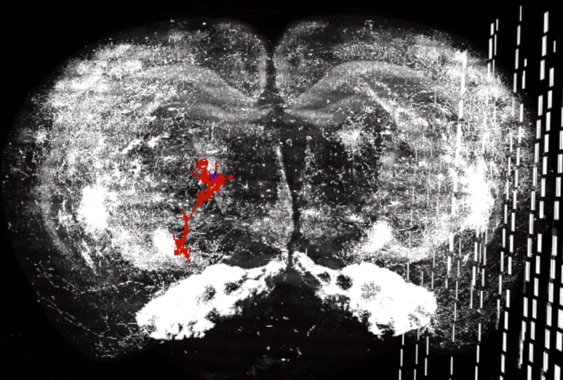
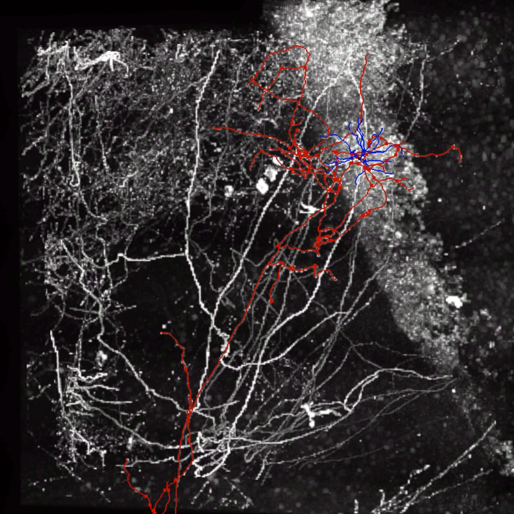
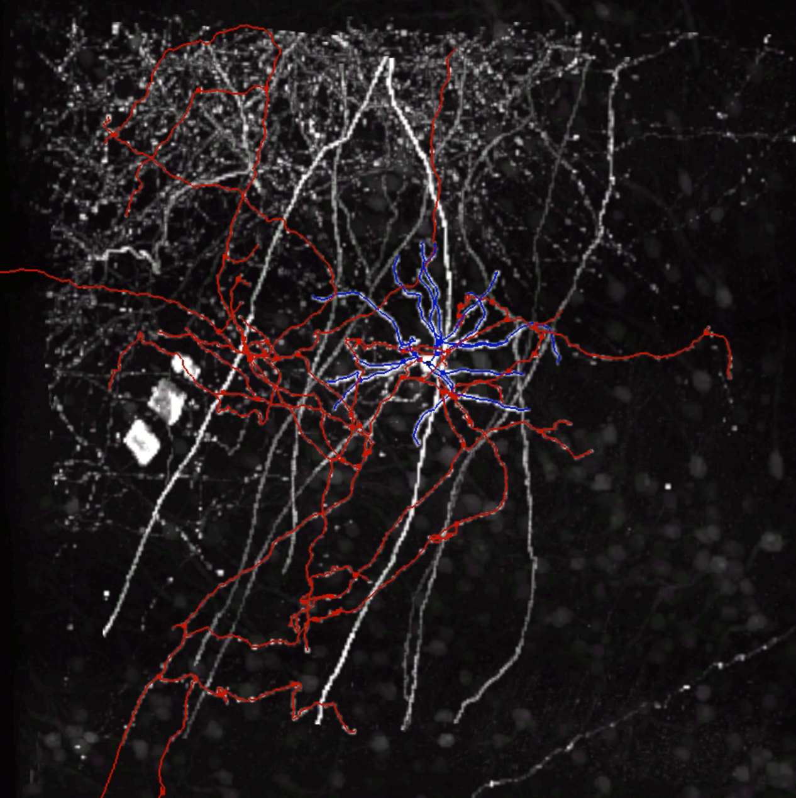
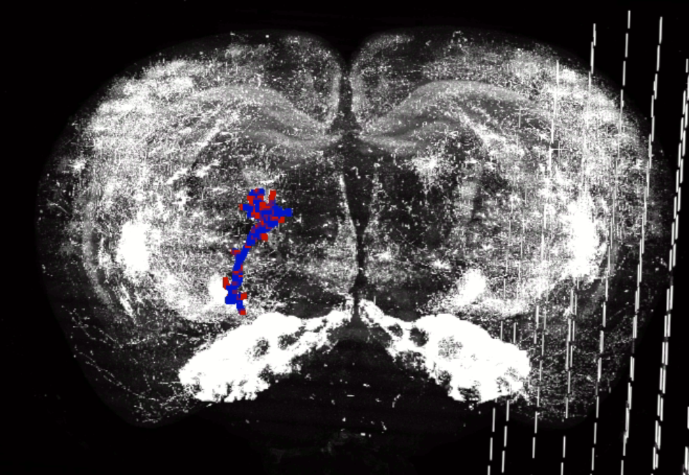
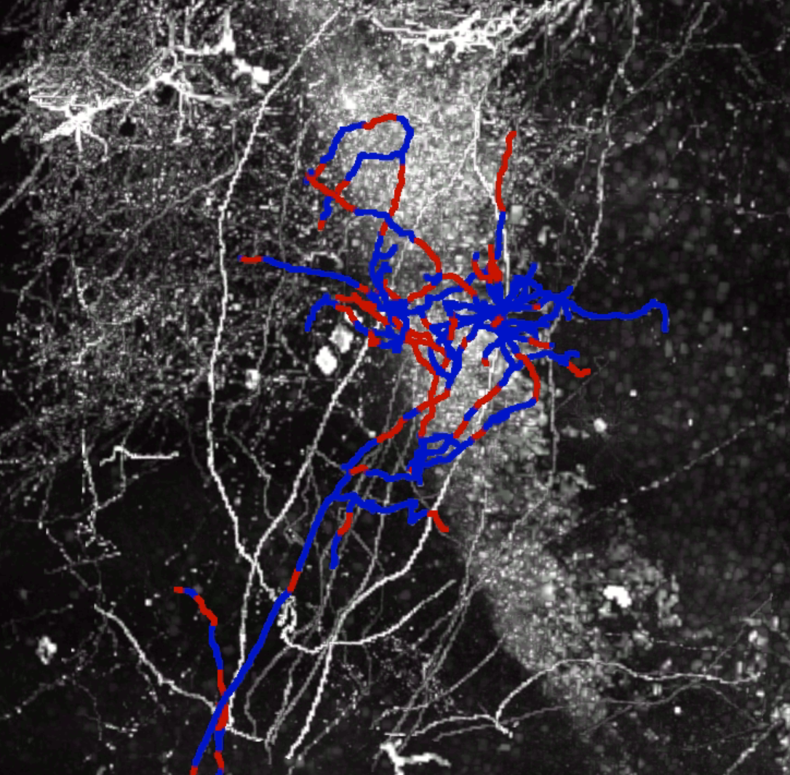
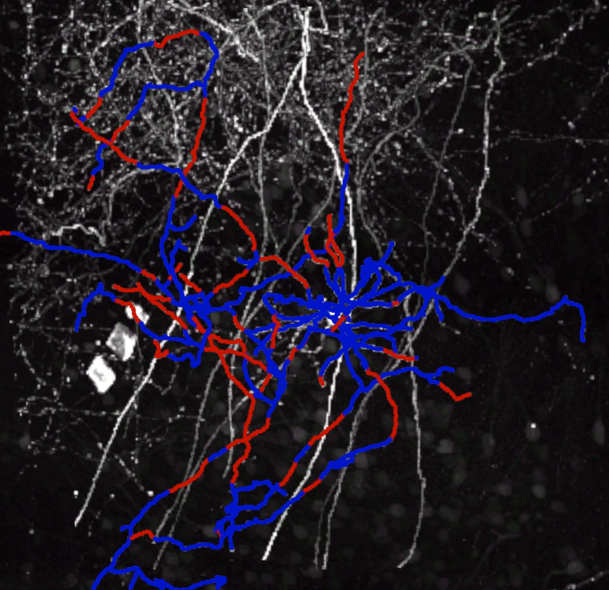
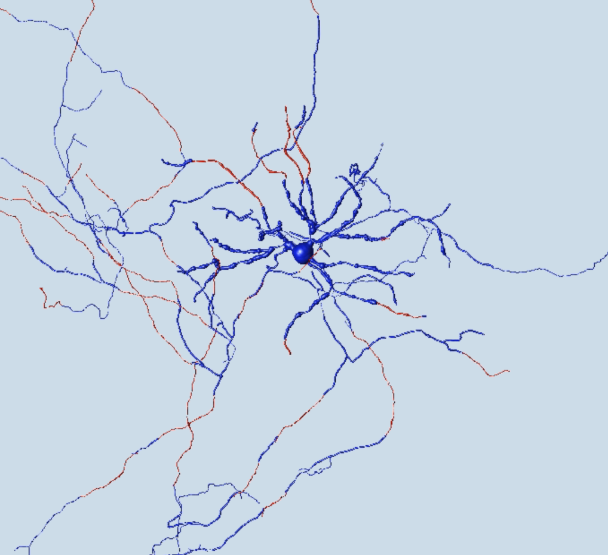

# Reconstruction of neuron tree based on the app2 and ground truth data

Experiment code

Fork from [v3d_external](https://github.com/Vaa3D/v3d_external)

Build from branch [QT6_NEW](https://github.com/Vaa3D/v3d_external/tree/QT6_NEW)

## Demo Image

### Ground Truth Image







### Generated Image







### Detailed Image



## Wheel built by myself

### Geometry

```c++

const double eps=1e-7;

bool double_eq(const double & a,const double & b){
    return std::abs(a-b)<eps;
}

bool XYZ_eq(const XYZ & p1,const XYZ & p2){
    return double_eq(p1.x,p2.x) && double_eq(p1.y,p2.y) && double_eq(p1.z,p2.z);
}

struct XYZ_Pair{
    XYZ p1;
    XYZ p2;
    XYZ_Pair(const XYZ & _p1,const XYZ & _p2):p1(_p1),p2(_p2){}
    bool operator == (const XYZ_Pair & cmp) const {
        return (XYZ_eq(p1,cmp.p1) && XYZ_eq(p2,cmp.p2))||(XYZ_eq(p1,cmp.p2) && XYZ_eq(p2,cmp.p1));
    }
    bool operator < (const XYZ_Pair & cmp) const {
        return p1.x<cmp.p1.x;
    }
};

void Delete_Redundant_Seg(V_NeuronSWC_list & segments){
    V_NeuronSWC_list lines;

    for(auto it=segments.seg.begin();it!=segments.seg.end();++it)
    {
        V_NeuronSWC & segment=*it;
        for(int i=1;i<segment.row.size();++i)
        {
            V_NeuronSWC newSeg;
            newSeg.append(segment.row.at(i-1));
            newSeg.append(segment.row.at(i));
            newSeg.row[0].n=1;newSeg.row[0].parent=2;
            newSeg.row[1].n=2;newSeg.row[1].parent=-1;
            lines.append(newSeg);
        }
    }

    static QVector<XYZ_Pair> vc;
    static int low=0;
    std::vector<int> del;
    for(int i=low;i<lines.seg.size();++i){
        const V_NeuronSWC_unit & u1=lines.seg[i].row[0];
        const V_NeuronSWC_unit & u2=lines.seg[i].row[1];
        XYZ p1,p2;
        p1.x=u1.x;
        p1.y=u1.y;
        p1.z=u1.z;
        p2.x=u2.x;
        p2.y=u2.y;
        p2.z=u2.z;
        XYZ_Pair pr=XYZ_Pair(p1,p2);
        bool if_del=false;
        for(const XYZ_Pair & cmp:vc){
            if(cmp==pr){
                if_del=true;
                break;
            }
        }
        if(if_del){
            del.push_back(i);
        }else{
            vc.push_back(pr);
        }
    }
    for(int i=del.size()-1;i>=0;--i){
        lines.seg.erase(lines.seg.begin()+del[i]);
    }
    low=lines.seg.size();

    segments=lines;
}

double distance_square(const NeuronSWC & point_a,const NeuronSWC & point_b){
    return (point_a.x-point_b.x)*(point_a.x-point_b.x)+(point_a.y-point_b.y)*(point_a.y-point_b.y)+(point_a.z-point_b.z)*(point_a.z-point_b.z);
}

bool between(const int & mid,const int & left,const int & right){   //double?
    return mid>=left&&mid<=right;
}

bool In_Box(const CellAPO & centerAPO,const int & blocksize,const NeuronSWC & point){
    return between(point.x,centerAPO.x-blocksize/2,centerAPO.x+blocksize/2)&&between(point.y,centerAPO.y-blocksize/2,centerAPO.y+blocksize/2)&&between(point.z,centerAPO.z-blocksize/2,centerAPO.z+blocksize/2);
}

double distance_XYZ(const XYZ & p1,const XYZ & p2){
    XYZ vec=p2-p1;
    return sqrt(vec.x*vec.x+vec.y*vec.y+vec.z*vec.z);
}
double distance_unit(const V_NeuronSWC_unit & p1,const V_NeuronSWC_unit & p2){
    XYZ vec=XYZ(p2.x-p1.x,p2.y-p1.y,p2.z-p1.z);
    return sqrt(vec.x*vec.x+vec.y*vec.y+vec.z*vec.z);
}
double dot_mul(const XYZ & mid,const XYZ & p1,const XYZ & p2){  //dot multiply mid->p1 and mid-p2
    XYZ diff1=p1-mid,diff2=p2-mid;
    return diff1.x*diff2.x+diff1.y*diff2.y+diff1.z*diff2.z;
}
double dot_mul(const XYZ & p1,const XYZ & p2){                  //dot multiply vector p1 and vector p2
    return p1.x*p2.x+p1.y*p2.y+p1.z*p2.z;
}
XYZ projection(const XYZ & cal_point,const XYZ & p1,const XYZ & p2){
    double dm=dot_mul(p1,cal_point,p2);
    return p1+(p2-p1)*(dm/distance_XYZ(p1,p2))/distance_XYZ(p1,p2);
}
double dot_to_line(const XYZ & cal_point,const XYZ & p1,const XYZ & p2){
    XYZ proj=projection(cal_point,p1,p2);
    double dm=dot_mul(proj-p1,proj-p2);
    if(dm<0) return distance_XYZ(cal_point,proj);
    return std::min(distance_XYZ(cal_point,p1),distance_XYZ(cal_point,p2) );
}
double Distance_Unit_To_Seg(const V_NeuronSWC_unit & p, const V_NeuronSWC & s){  //传参XYZ可以优化
    double mn=1e8;
    XYZ check_point;
    check_point.x=p.x;check_point.y=p.y;check_point.z=p.z;
    QMap<int,V_NeuronSWC_unit> mp;
    for(int i=0;i<s.row.size()-1;++i){
        mp[s.row[i].n]=s.row[i];
    }
    for(int i=0;i<s.row.size()-1;++i){
        XYZ p1,p2;
        int parent_id=s.row[i].parent;
        if(parent_id>0){
            p1.x=s.row[i].x;p1.y=s.row[i].y;p1.z=s.row[i].z;
            p2.x=mp[parent_id].x;p2.y=mp[parent_id].y;p2.z=mp[parent_id].z;
            mn=std::min(mn,dot_to_line(check_point,p1,p2));
        }
    }

    return mn;
}
double Distance_Unit_To_Tree(const V_NeuronSWC_unit & p,const V_NeuronSWC_list & Check_Tree){
    if(Check_Tree.seg.empty()) return 1e-8;
    double mn=1e8;
    for(const V_NeuronSWC & Seg:Check_Tree.seg){
        mn=std::min(mn,Distance_Unit_To_Seg(p,Seg));
    }
    return mn;
}
double Distance_Unit_To_Tree(const NeuronSWC & p,const V_NeuronSWC_list & Check_Tree){
    V_NeuronSWC_unit u;
    u.x=p.x;u.y=p.y;u.z=p.z;
    return Distance_Unit_To_Tree(u,Check_Tree);
}
double Tree_Length(const V_NeuronSWC_list & tree){
    double ret=0;
    for(const V_NeuronSWC & seg:tree.seg){
        for(int i=0;i<seg.row.size()-1;++i){
            ret+=distance_unit(seg.row[i],seg.row[i+1]);
        }
    }
    return ret;
}
bool Check_Seg_Identical(const V_NeuronSWC & Check_Seg,const V_NeuronSWC_list & Answer_Tree){
    double mean=0;
    double mxx=-1e8;
    int num=0;
    for(const V_NeuronSWC_unit & Check_Point:Check_Seg.row){
         double mx=-1e8;
         for(const V_NeuronSWC & Answer_Seg:Answer_Tree.seg){
            mx=std::max(mx,Distance_Unit_To_Seg(Check_Point,Answer_Seg));
            mxx=std::max(mxx,mx);
         }
         ++num;
         mean+=mx;
    }
    mean/=num;
    return mean<seg_identical_threshold_mean && mxx<seg_identical_threshold_mx;
}
bool Check_Tree_Identical(const V_NeuronSWC_list & Check_Tree,const V_NeuronSWC_list & Answer_Tree){
    if(Answer_Tree.seg.empty()) return false;
    bool flag=true;
    for(const V_NeuronSWC & Check_Seg:Check_Tree.seg){
        flag&=Check_Seg_Identical(Check_Seg,Answer_Tree);
        if(!flag) break;
    }
    return flag;
}
bool Check_Tree_Identical(const NeuronTree & Check_Tree,const V_NeuronSWC_list & Answer_Tree){
    NeuronTree cpy=Check_Tree;
    V_NeuronSWC_list ls=NeuronTree__2__V_NeuronSWC_list(cpy);
    return Check_Tree_Identical(ls,Answer_Tree);
}
bool Check_Tree_Length(const V_NeuronSWC_list & Check_Tree,const V_NeuronSWC_list & Answer_Tree){
    double len1=Tree_Length(Check_Tree),len2=Tree_Length(Answer_Tree);
    return std::abs(len1-len2)/std::max(len1,len2)<length_indentical_rate;
}
double Distance_Point_To_Border(const NeuronSWC & point,const int & blocksize){
    return std::min({point.x,abs(blocksize-point.x),point.y,abs(blocksize-point.y),point.z,abs(blocksize-point.z)});
}
double Vector_Angle(const XYZ & a,const XYZ & b){
    static const double PI=std::acos(-1);
    return std::acos(dot_mul(a,b)/distance_XYZ(XYZ(0.0),a)/distance_XYZ(XYZ(0.0),b))*(180/PI);
}
bool has_same_vector(const V_NeuronSWC & Seg,const QVector<XYZ> & v){
    XYZ v1;
    v1.x=Seg.row.front().x;
    v1.y=Seg.row.front().y;
    v1.z=Seg.row.front().z;
    XYZ v2;
    v2.x=Seg.row.back().x;
    v2.y=Seg.row.back().y;
    v2.z=Seg.row.back().z;
    XYZ seg=v1-v2;
    for(const XYZ & vec:v){
        if(Vector_Angle(seg,vec)<30||Vector_Angle(seg,vec)>150){
            return true;
        }
    }
    return false;
}

```

### File related

```c++
void Drop_NeuronSWC(const QString &path,const QList<NeuronSWC> & output){
    QFile file(path);
    qDebug()<<file.open(QIODevice::WriteOnly|QIODevice::Text);

    QTextStream out(&file);
    for(const NeuronSWC & swc:output){
        out<<swc.n<<" "<<swc.type<<" "<<swc.x<<" "<<swc.y<<" "<<swc.z<<" "<<swc.r<<" "<<swc.pn<<"\n";
    }
    file.close();
}

void crop_ans_swc(const QString& input_file,const int &X,const int &Y,const int &Z,const int &blocksize,const QString& output_file){
    NeuronTree ans_tree=readSWC_file(input_file);

    QList<NeuronSWC> output;
    for(NeuronSWC & swc:ans_tree.listNeuron){
        if(between(swc.x,X-blocksize/2,X+blocksize/2)&&between(swc.y,Y-blocksize/2,Y+blocksize/2)&&between(swc.z,Z-blocksize/2,Z+blocksize/2)){
            output.push_back(swc);
        }
    }

    QFile file(output_file);
    qDebug()<<file.open(QIODevice::WriteOnly|QIODevice::Text);

    QTextStream out(&file);
    for(NeuronSWC & swc:output){
        out<<swc.n<<" "<<swc.type<<" "<<swc.x-X+blocksize/2<<" "<<swc.y-Y+blocksize/2<<" "<<swc.z-Z+blocksize/2<<" "<<swc.r<<" "<<swc.pn<<"\n";
    }
    file.close();
}

QString generate_apo_name(const std::string & path,const CellAPO &centerAPO){
    return QString::fromStdString(path+"/"+std::to_string(int(centerAPO.x))+".000_"+std::to_string(int(centerAPO.y))+".000_"+std::to_string(int(centerAPO.z))+".000.apo");
}

QString generate_marker_name(const std::string & path,const ImageMarker &startPoint){
    return QString::fromStdString(path+"/"+std::to_string(int(startPoint.x))+".000_"+std::to_string(int(startPoint.y))+".000_"+std::to_string(int(startPoint.z))+".000.marker");
}

QString generate_eswc_name(const std::string & path,const CellAPO &centerAPO){
    return QString::fromStdString(path+"/"+std::to_string(int(centerAPO.x))+".000_"+std::to_string(int(centerAPO.y))+".000_"+std::to_string(int(centerAPO.z))+".000.eswc");
}

QString generate_swc_name(const std::string & path,const CellAPO &centerAPO){
    return QString::fromStdString(path+"/"+std::to_string(int(centerAPO.x))+".000_"+std::to_string(int(centerAPO.y))+".000_"+std::to_string(int(centerAPO.z))+".000.swc");
}

```

### Border and Direction

```c++

QVector<std::pair<NeuronSWC,QQueue<XYZ> > > Find_Border(const NeuronTree & App2_Tree,const int & blocksize,const QMap<int,QVector<int> > & son, const QMap<int,NeuronSWC> & mp){

    const int compacity=5;      //decide how many vectors to memorize
    QVector<std::pair<int,QQueue<XYZ> > > border;
    QQueue<std::pair<int,QQueue<XYZ> > > q;
    q.push_back(std::make_pair(son[-1][0],QQueue<XYZ>() ) );
    //BFS to find the border
    while(!q.empty()){
        std::pair<int,QQueue<XYZ> > now=q.front();
        q.pop_front();
        int now_id=now.first;
        const NeuronSWC & now_swc=mp[now_id];
        for(const int & to:son[now_id]){
            QQueue nex_queue=now.second;
            const NeuronSWC & nex_swc=mp[to];
            if(nex_queue.size()>=compacity){
                nex_queue.pop_front();
            }
            nex_queue.push_back(XYZ(nex_swc.x-now_swc.x,nex_swc.y-now_swc.y,nex_swc.z-now_swc.z));
            if(son[to].empty()){    //if want to cut more, edit here
                border.push_back(std::make_pair(to,nex_queue));
            }else{
                q.push_back(std::make_pair(to,nex_queue));
            }
        }
    }

    QVector<std::pair<NeuronSWC,QQueue<XYZ> > > ret;
    for(const std::pair<int,QQueue<XYZ> >  & i:border){
        const int & id=i.first;
        const XYZ & point=mp[id];

        double mn=std::min({point.x,abs(blocksize-point.x),point.y,abs(blocksize-point.y),point.z,abs(blocksize-point.z)});

        if(mn>Border_Threshold) continue;

        //save Border_Point and its previous vector
        ret.push_back(std::make_pair(mp[id],i.second));

    }
    return ret;
}
std::vector<int> Judge_Direction(const XYZ & vec){
    int weight[3][3]={{0,1,1},{1,0,1},{1,1,0}};
    double mn=1e10;
    int pick= -1;
    //decide to expand in which axis
    //pick=0 equals weight[i][0]=0, vec is more close to axis x
    //pick=2 equals weight[i][1]=0, vec is more close to axis y
    //pick=4 equals weight[i][2]=0, vec is more close to axis z

    std::vector<int> direction={0,1,2};
    std::sort(direction.begin(),direction.end(),[&](int a,int b){
        return weight[a][0]*vec.x*vec.x+weight[a][1]*vec.y*vec.y+weight[a][2]*vec.z*vec.z < weight[b][0]*vec.x*vec.x+weight[b][1]*vec.y*vec.y+weight[b][2]*vec.z*vec.z;
    });
    for(int i=0;i<3;++i){
        direction[i]*=2;
    }
    for(int i=0;i<3;++i){
        if(direction[i]==0 && vec.x<0)
            ++direction[i];
        if(direction[i]==2 && vec.y<0)
            ++direction[i];
        if(direction[i]==4 && vec.z<0)
            ++direction[i];
    }
    for(int i=2;i>0;--i){
        direction.push_back(direction[i]+((direction[i]&1)?-1:1 ) );
    }

    return direction;

    //decide to expand on positive axis or negative axis
    //pick=0 positive axis x
    //pick=1 negative axis x
    //pick=2 positive axis y
    //pick=3 negative axis y
    //pick=4 positive axis z
    //pick=5 negative axis z
}
int Find_Nearest_Id(const ImageMarker & startPoint,const QVector<NeuronSWC> & Points){
    int mn=1e8;
    int pick_id=-1;
    for(const NeuronSWC & i:Points){
        double dis=distance_XYZ(XYZ(startPoint),XYZ(i));
        if(mn>dis){
            mn=dis;
            pick_id=i.n;
        }
    }
    return pick_id;
}
NeuronTree Get_Answer_Tree(const int & origin_id,const CellAPO & centerAPO,const int & blocksize,QVector<int> & Answer_Tree_Idx){
    NeuronTree Return_Tree;
    int amount=0;
    QQueue<std::pair<int,int> > q;
    QMap<int, bool> vis;
    q.push_back(std::make_pair(-1,origin_id));    //-1 is new, pick_id is old
    while(!q.empty()){
        int prev=q.front().first;   //new
        int now=q.front().second;   //old
        q.pop_front();

        if(!In_Box(centerAPO,blocksize,Answer_Map[now])) continue;
        Answer_Tree_Idx.push_back(now);
        vis[now]=true;

        NeuronSWC Add_Point=Answer_Map[now];
        ++amount;
        Add_Point.n = amount;
        Add_Point.pn= prev;
        Add_Point.timestamp=now;
        Return_Tree.listNeuron.push_back(Add_Point);

        for(const int & i:Answer_Graph[now]){
            if(i>0 && !vis.count(i))
                q.push_back(std::make_pair(amount,i));
        }
    }
    return Return_Tree;
}

QVector<NeuronSWC>  Find_Extend_Marker(const int & center_id,const CellAPO & centerAPO, const int & blocksize, const NeuronTree & Answer_Tree){

    QVector<NeuronSWC> Extend_Marker;
    XYZ st;

    for(const NeuronSWC & swc:Answer_Tree.listNeuron){
        if(swc.pn==-1){
            st=swc;
        }
        if(In_Box(centerAPO,blocksize,swc)){
            for(const int & to:Answer_Graph[swc.timestamp]){
                if(to<=0) continue;
                const NeuronSWC & check = Answer_Map[to];
                if(!In_Box(centerAPO, blocksize, check)){
                    NeuronSWC Add_Point=swc;
                    Extend_Marker.push_back(Add_Point);
                    break;
                }
            }
        }
    }
    if(center_id!=0){
        int delete_id=-1;
        double mn=1e8;
        for(int i=0;i<Extend_Marker.size();++i){
            double dis=distance_XYZ(XYZ(Extend_Marker[i]),st);
            if(mn>dis){
                mn=dis;
                delete_id=i;
            }
        }
        if(!Extend_Marker.empty() && delete_id<Extend_Marker.size() && delete_id!=-1)
          Extend_Marker.erase(Extend_Marker.begin()+delete_id);
    }
    return Extend_Marker;
}


```
